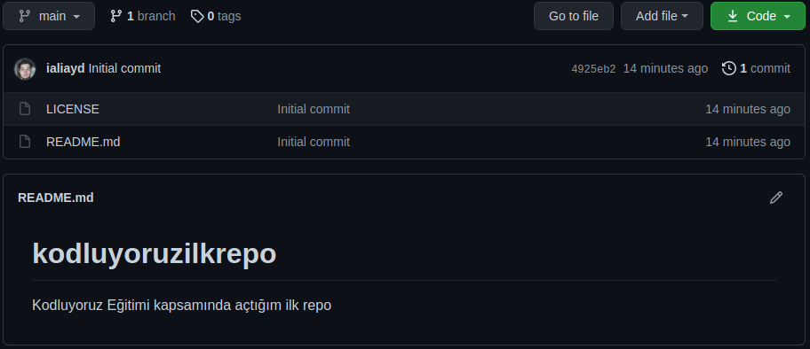

# Kodluyoruz İlk Repo

Bu repo [Kodluyoruz](https://app.patika.dev/egitimler/frontend-web-development-patikasi) Front-End eğitiminde oluşturduğumuz ilk repo. İçerisinde bir adet README dosyası, bir adet de index.html barındırıyor.



## Installation

Öncelikle projeyi clonelayın. (Buraya sizin reponuzdan aldığınız link gelecek).

```
https://github.com/ialiayd/kodluyoruzilkrepo.git
```

## Usage

Projeyi cloneladıktan sonra Visual Studio Code programında açınız.

Linux için;

```
cd kodluyoruzilkrepo
code .
```

## Contributing
Pull requestler kabul edilir. Büyük değişiklikler için lütfen önce neyi değiştirmek istediğinizi tartışmak için konu açınız.

## License
[MIT](https://github.com/ialiayd/kodluyoruzilkrepo/blob/main/LICENSE)